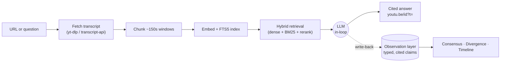

# YouTube Brain


**Turn a YouTube creator's archive into a searchable, timestamp-cited advisor —
and keep an LLM in the loop so it runs on the free tier.**

Share a channel, playlist, or video URL. Transcripts are fetched, chunked,
embedded, and (optionally) distilled into typed *observations*. Then ask
questions and get answers with clickable `youtu.be/<id>?t=<sec>` citations —
across one creator, or *many* at once.

> One person + Claude Code = a research team that has actually watched every
> video, remembers what each creator said, and can tell you where they **agree**,
> where they **disagree**, and whose advice **changed over time**.

---

## Overview — why this exists

Classic RAG over video is shallow: every question re-retrieves raw transcript
chunks, an LLM skims them, and the answer evaporates. Nothing accumulates. Ask
the same corpus a second question and it starts from zero again. You can't ask
"who *disagrees* about this?" because there's no memory of what anyone claimed.

YouTube Brain treats that as the bug. Borrowing the mental model from Karpathy's
[LLM Wiki](https://gist.github.com/karpathy/442a6bf555914893e9891c11519de94f) —
*don't just retrieve raw documents, have the LLM incrementally build and maintain
a persistent, cited knowledge layer* — it is organized as **three layers**:

```
┌────────────────────────────────────────────────────────────────┐
│  SCHEMA / CONFIG      observation taxonomy · SKILL workflows     │  directs the LLM
├────────────────────────────────────────────────────────────────┤
│  OBSERVATION LAYER    typed, cited claims · clusters · summaries │  LLM-maintained,
│  (the "brain")        → consensus · divergence · timeline        │  compounds over time
├────────────────────────────────────────────────────────────────┤
│  RAW SOURCES          transcripts · chunks · embeddings · FTS5   │  immutable, re-derivable
└────────────────────────────────────────────────────────────────┘
```

- **Raw sources** are immutable: transcripts split into ~150s chunks, embedded,
  and indexed for hybrid (dense + lexical) retrieval.
- **The observation layer** is the brain. As you (or Claude) read transcripts,
  you persist *typed, cited claims* — `tactic`, `tool`, `metric`, `monetization`,
  `mistake`, … — each pinned to a `youtu.be?t=` timestamp. These are embedded and
  clustered, so the brain *compounds* instead of re-deriving everything per query.
- **The schema** is the taxonomy of observation types plus the
  [skill workflows](skills/youtube-brain/SKILL.md) that tell the LLM how to
  ingest, answer, and maintain the layer.

Once a corpus has an observation layer, three things fall out that a chunk-only
RAG can't do — **consensus** (what multiple creators independently said),
**divergence** (who clashes, and how), and **timeline** (whose stance changed).
The counts behind them are *computed from the data*, never guessed by an LLM.

The key insight, also from Karpathy: **LLMs don't get bored.** The maintenance
work that makes humans abandon wikis — re-reading, reconciling, flagging stale
claims — is exactly what an LLM-in-the-loop does cheaply. The `lint` command is
that maintenance pass (contradictions & stale advice); see below.

---

## Why not just ask AI directly?

| You want… | Raw ChatGPT/Claude paste | NotebookLM | YouTube's native "Ask" | **YouTube Brain** |
|---|---|---|---|---|
| Timestamped citations | ❌ hallucinates | ⚠️ per-source | ✅ per-video | ✅ `youtu.be/<id>?t=` everywhere |
| **Across many creators at once** | ❌ | ❌ one notebook | ❌ one video | ✅ consensus + attribution |
| **Disagreement / divergence** | ❌ | ❌ | ❌ | ✅ `lint` & cross-creator |
| **Tracks stance change over time** | ❌ | ❌ | ❌ | ✅ temporal `lint` |
| Memory that compounds | ❌ | ⚠️ within a notebook | ❌ | ✅ persistent observation layer |
| Runs on a free API tier | ⚠️ | ✅ (Google's) | ✅ (Premium) | ✅ **zero `generate` calls** |

YouTube's own Gemini "Ask" now does the single-video summary natively — so
YouTube Brain leans into what it *can't* do: **cross-creator and temporal
intelligence** over a corpus you control.

---

## The key idea: keep an LLM in the loop, spend (almost) no quota

Gemini's free tier is brutal for this use case — about **20 `generate` calls per
day, per project** (shared across flash models). A naive "ingest → LLM summary →
LLM answer" pipeline burns that in a handful of videos.

So YouTube Brain offers **two paths**:

| Path | What spends quota | Who summarizes / answers | Use it for |
|------|-------------------|--------------------------|------------|
| **Bridge** (`scripts/skill_bridge.py`) | **`embed` only — zero `generate`** | **An LLM driving it** (Claude Code) | Daily research; the headline path |
| **CLI** (`ytbrain ingest` / `ask`) | Gemini `generate` (~2/video) + embed | Gemini | Hands-off, when you have quota to spend |

The **bridge** fetches transcripts, chunks, and embeds them (cheap, large `embed`
quota), then hands the raw material to an LLM *driving it* — e.g. Claude Code via
the bundled skill — to write the summary or the cited answer. You get the full
cited-RAG experience without ever touching the 20/day `generate` wall.

---

## Architecture & data flow



**Stack:** Python 3.12 · SQLite (FTS5 + JSON) · Gemini (flash + `gemini-embedding-001`,
768-dim) · FastAPI. Source under `src/youtube_brain/`:

| Package | Role |
|---|---|
| `ingest/` | resolver · transcripts · chunker · **`pull`** (zero-generate lite-ingest) · pipeline |
| `retrieval/` | 4-lane hybrid search (dense + FTS) + reranker |
| `observations/` | extractor · clustering · **`report`** (consensus) · **`lint`** (divergence) · timeline |
| `llm/` | Gemini client with multi-key rotation, per-day exhaustion tracking, 429/5xx backoff |
| `storage/` | SQLite schema + CRUD | 
| `api/` · `cli.py` | FastAPI app · `ytbrain` command |

---

## Workflows at a glance

The bundled [Claude skill](skills/youtube-brain/SKILL.md) exposes the bridge as
seven workflows. Each costs **zero `generate`** quota.

| | Workflow | Command | What it does |
|---|---|---|---|
| **A** | Pull & summarize | `pull <url>` | Lite-ingest a URL; Claude writes the summary from the transcript |
| **B** | Ask (one creator) | `context <brain_id> "<q>"` | Retrieve top chunks; Claude writes a cited answer |
| **C** | Cross-creator synthesis | `context --brains <ids> "<q>"` | Consensus + disagreement across creators, attributed |
| **D** | Write-back | `save <obs.json>` | Persist typed, cited observations so the brain compounds |
| **E** | Intelligence report | `report --all` | Deterministic consensus report (counts computed, not guessed) |
| **F** | Ask YouTube | `search … --recent` → `pull --brain` | Research an open question from scratch, with fresh sources |
| **G** | **Lint** | `lint --brains <ids>` | Surface contradictions, flip-flops & stale advice |

---

## Quick start

```bash
git clone https://github.com/melchior95/youtube-brain.git && cd youtube-brain
python -m venv .venv && . .venv/Scripts/activate     # POSIX: . .venv/bin/activate
pip install -e ".[dev]"

cp .env.example .env          # then paste a Gemini key — https://aistudio.google.com/apikey
pytest -k "not integration"   # ~165 unit tests, no network
```

Add as many keys as you like — `YTBRAIN_GEMINI_API_KEY`, `..._KEY2`, `..._KEY3`,
… are all loaded and **rotated automatically** (per-key per-day exhaustion is
tracked, requests staggered, 429/5xx backed off).

**To drive it with Claude Code**, copy the skill into your skills dir and set the
repo path inside it:

```bash
cp -r skills/youtube-brain ~/.claude/skills/      # then edit the "Mandatory setup" path
```

Now in Claude Code you can just say *"summarize https://youtu.be/…"*, *"ask
youtube what's the best way to market an app with TikTok"*, or *"where do these
creators disagree?"* and the skill drives the bridge for you.

---

## Detailed guide

Every command prints **one JSON value to stdout** (logs go to stderr). The
examples below show real commands with trimmed output.

### Guide 1 — Build a creator brain

A single-video pull is grouped under that creator's **channel brain** (keyed by
the stable `channel_id`, not the display name), so pulling more videos from the
same creator accumulates into one brain.

```bash
python scripts/skill_bridge.py pull "https://youtu.be/Bbjv9-00tv0"
```
```jsonc
{
  "brain_id": "22d21239-…", "brain_name": "Fabio Morena",
  "videos_processed": 1, "chunks_created": 51,
  "videos": [{ "youtube_id": "Bbjv9-00tv0", "transcript": "…full text…",
               "transcript_truncated": false }]
}
```

The transcript comes back in full (`--max-chars 0` by default) — Claude reads it
and writes the summary, key points, and notable claims. Pull a few more of the
creator's videos and the brain grows; then ask it anything (Guide 3).

> Channel / playlist URLs default to `--limit 6` to bound cost. Raise it only
> when you mean to: `pull "https://youtube.com/@creator" --limit 12`.

### Guide 2 — Ask YouTube (research a question from scratch)

When the question isn't tied to a URL or a creator you've pulled — *"what's the
best way to use TikTok AI videos to market my app?"* — discover → ingest →
answer. For fast-moving topics, `--recent` filters to fresh uploads (old how-to
advice goes stale fast).

```bash
# 1. search, recent-only
python scripts/skill_bridge.py search "AI tiktok videos to market my app" --recent month --limit 8
```
```jsonc
{ "recent": "month", "count": 8, "results": [
  { "youtube_id": "y0INOAiFalI", "title": "How I Scaled My App to $5K/Month Using Only AI-Generated…",
    "channel": "Your Average Tech", "duration_min": 16.4, "view_count": 48213 },
  { "youtube_id": "B5zYOW6NXxM", "title": "How I Automated 30 Days of AI Influencer TikToks", … } ] }
```
```bash
# 2. curate the best 5–8, then ingest each into ONE topic brain
python scripts/skill_bridge.py pull "https://youtu.be/y0INOAiFalI" --brain "tiktok-ai-marketing"
python scripts/skill_bridge.py pull "https://youtu.be/B5zYOW6NXxM" --brain "tiktok-ai-marketing"
# …

# 3. retrieve across the topic brain and answer
python scripts/skill_bridge.py context "<topic brain_id>" "best way to market an app with AI TikToks" --k 16
```

Claude then synthesizes across the videos, attributes each point to its
`creator`, cites every claim with a `youtu.be/<id>?t=` link, surfaces each
video's `published` date ("as of <month>"), and notes where creators disagree.
The topic brain persists — follow-ups reuse it for free.

### Guide 3 — Ask one creator, or many

```bash
# one creator you've already pulled
python scripts/skill_bridge.py context <brain_id> "what does he say about thumbnails?" --k 12

# across several creators — consensus + who diverges
python scripts/skill_bridge.py context --brains <id1>,<id2>,<id3> "do you need a niche?" --k 18

# across everything pulled so far
python scripts/skill_bridge.py context --all "is AI a real moneymaker or hype?" --k 18
```

Each result carries `creator`, `brain`, and a `citation`, so the answer can say
*who* said *what* — leading with consensus, then unique/diverging takes.

### Guide 4 — Make it compound: write-back, report, lint

Summaries and cross-creator answers are re-derived every time unless you
**persist** them. Write-back turns a brain from "re-read the chunks each query"
into a durable, cited intelligence layer.

```bash
# 1. Claude extracts typed observations (evidence quotes copied VERBATIM so they
#    attribute to a chunk and recover a timestamp), then:
python scripts/skill_bridge.py save observations.json

# 2. deterministic consensus report — counts computed from clusters, not guessed
python scripts/skill_bridge.py report --all --out data/report.md

# 3. the DUAL of the report: contradictions, flip-flops & stale advice
python scripts/skill_bridge.py lint --brains <id1>,<id2>
```

`lint` is the maintenance pass. It groups observations by shared entity, orders
them by date, and emits only groups with real tension (≥2 sources, or spanning
≥2 dates). You (the LLM) adjudicate each as **contradiction / evolution / stale /
consistent** — and it won't manufacture disagreement where there isn't any:

```jsonc
{ "scope": "cross-creator", "candidate_count": 1, "candidates": [
  { "entity": "AI skills", "distinct_sources": 2, "observations": [
      { "creator": "Nate Herk",    "claim": "The transferable skills under the tool matter more…",
        "citation": "https://youtu.be/…?t=…" },
      { "creator": "Shane Hummus", "claim": "AI skills can pay more than a college degree",
        "citation": "https://youtu.be/…?t=…" } ] } ] }
```

This — *temporal and divergence intelligence over a corpus you control* — is the
thing the per-video AI tools structurally can't do.

---

## Command reference

**Bridge** (`python scripts/skill_bridge.py <cmd>`, zero generate):

| Command | Key flags | Output |
|---|---|---|
| `pull <url>` | `--limit N` · `--max-chars N` · `--brain NAME` | brain id + full transcripts |
| `search <query>` | `--limit N` · `--recent today\|week\|month\|year` | ranked candidate videos |
| `brains` | — | all brains (id, name, video_count, status) |
| `context <brain_id> "<q>"` | `--k N` · `--brains <ids>` · `--all` | top cited chunks |
| `save <path.json>` | — | observations inserted + embedded |
| `observations` | `<brain_id>` · `--brains` · `--all` · `--limit N` | persisted cited observations |
| `report` | `<brain_id>` · `--brains` · `--all` · `--out PATH` | consensus report (JSON + Markdown) |
| `lint` | `<brain_id>` · `--brains` · `--all` · `--max-groups N` | tension candidates to adjudicate |

**CLI** (`ytbrain …`, spends `generate` quota):

```bash
ytbrain ingest "https://youtube.com/@creator" --limit 5   # ~2 generate calls/video
ytbrain ask <brain_id> "how does he structure a video intro?"
ytbrain list
```

---

## Design philosophy

- **Counts are computed, never guessed.** Consensus/divergence numbers come from
  clustered observation data — an LLM writes the prose, but only ever wraps
  numbers that are real. (The same discipline caught a bug where unit tests
  passed while citations were silently broken — so: *smoke-test on real data*.)
- **Cite or don't claim.** Every answer line carries a `youtu.be/<id>?t=` link
  recovered from the chunk an evidence quote attributes to. No citation → say so.
- **Identity is the `channel_id`, not the display name.** A video-pull and a
  channel-pull of the same creator converge on one brain regardless of how
  YouTube renders the handle.
- **Zero-generate by default.** The bridge keeps an LLM in the loop precisely so
  the 20/day free tier is never the bottleneck.
- **DRY / YAGNI.** `lint` is the dual of `report` and reuses its observation
  loading and clustering rather than re-implementing them.

---

## Optional web demo (experimental)

`frontend/` is a React PWA that browses topic categories → creators, shows
per-video summaries, and renders a live cross-creator consensus tab. It's an
**optional, experimental demo** — not required, and not the focus of
maintenance. The CLI + bridge are the supported surface. See
[`frontend/README.md`](frontend/README.md) to run it.

---

## Cost & limits

- **`generate` free tier ≈ 20/day/project** (shared across flash models). The
  bridge avoids it entirely; the CLI does not.
- CLI ingestion spends ~2 `generate` calls per video — bound large channels with
  `--limit`.
- `embed` quota is far larger; the bridge relies on it.
- Read [`docs/LEARNINGS.md`](docs/LEARNINGS.md) before touching the Gemini
  client, rate limiting, or citations — it documents the non-obvious failures.

---

## Roadmap

- [x] Zero-generate bridge (pull · context · search) — Claude-in-the-loop
- [x] Observation layer — typed, cited claims that compound (write-back)
- [x] Deterministic consensus report (counts from clusters)
- [x] `lint` — contradictions, flip-flops & stale-advice detection
- [x] Recency-filtered "Ask YouTube" research flow
- [ ] Persist `lint` verdicts as durable articles (so the lint itself compounds)
- [ ] Semantic (cluster-based) lint axis to catch paraphrased entities
- [ ] `sqlite-vec` for dense retrieval as corpora grow past JSON-scan scale

---

## Tests

```bash
pytest -k "not integration" --ignore=tests/test_e2e.py
```

Integration / e2e tests need real API keys and network, and are excluded by
default.

---

## Disclaimer

YouTube Brain summarizes and cross-references what *creators* said, with
citations — it is a research aid, not advice. It does not verify creators'
claims, and surfacing a claim is not endorsing it. For finance, health, legal,
or similar topics: treat every cited claim as a creator's opinion to verify, not
a recommendation.

## License

[MIT](LICENSE).
