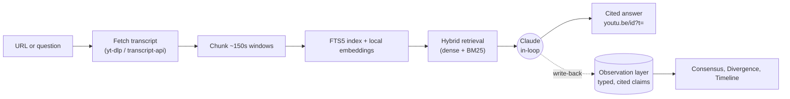

# YouTube Brain


Turn a YouTube creator's archive into a searchable, timestamp-cited advisor that
runs entirely on your Claude subscription. No API keys, no quotas, no external
services beyond YouTube itself.

Share a channel, playlist, or video URL. Transcripts get fetched (yt-dlp),
chunked, and indexed for hybrid retrieval (SQLite FTS5 keywords plus local
embeddings). Then ask questions and get answers with clickable
`youtu.be/<id>?t=<sec>` citations, across one creator or many at once. Claude,
driving the tool in-loop, does all the semantic work: summarizing, answering,
extracting observations, and synthesizing.

The goal: one person plus Claude Code becomes a research team that has actually
watched every video, remembers what each creator said, and can point to where
they agree, where they disagree, and whose advice changed over time.

## Why this exists

Classic RAG over video is shallow. Every question re-retrieves raw transcript
chunks, an LLM skims them, and the answer evaporates. Nothing accumulates. You
can't ask "who disagrees about this?" because there's no memory of what anyone
claimed.

YouTube Brain treats that as the bug. Borrowing the mental model from Karpathy's
[LLM Wiki](https://gist.github.com/karpathy/442a6bf555914893e9891c11519de94f),
instead of re-retrieving raw documents every time, the LLM incrementally builds
and maintains a persistent, cited knowledge layer. The system has three layers.

```
┌────────────────────────────────────────────────────────────────┐
│  SCHEMA / CONFIG      observation taxonomy, SKILL workflows       │  directs the LLM
├────────────────────────────────────────────────────────────────┤
│  OBSERVATION LAYER    typed cited claims, summaries               │  LLM-maintained,
│  (the "brain")        consensus, divergence, timeline             │  compounds over time
├────────────────────────────────────────────────────────────────┤
│  RAW SOURCES          transcripts, chunks, FTS5 + local embeddings│  immutable, re-derivable
└────────────────────────────────────────────────────────────────┘
```

The **raw sources** are immutable: transcripts split into ~150s chunks, indexed
in SQLite FTS5 for keyword search and embedded locally (fastembed) for semantic
search.

The **observation layer** is the brain. As Claude reads transcripts, it persists
typed, cited claims (`tactic`, `tool`, `metric`, `monetization`, `mistake`, and
so on), each pinned to a `youtu.be?t=` timestamp. The brain compounds instead of
re-deriving everything on every query.

The **schema** is the taxonomy of observation types plus the
[skill workflows](skills/youtube-brain/SKILL.md) that tell Claude how to ingest,
answer, and maintain the layer.

Once a corpus has an observation layer, three things become possible that a
chunk-only RAG can't do: consensus (what multiple creators independently said),
divergence (who clashes, and how), and timeline (whose stance changed). The
counts behind them are computed deterministically from the observations'
entities, never guessed by an LLM.

## No external API, Claude in the loop

Everything runs locally plus your Claude Code subscription:

- **Transcripts** come from `yt-dlp` / `youtube-transcript-api`.
- **Retrieval** is hybrid: **local embeddings** (fastembed, ONNX, model
  `bge-small-en-v1.5`) for semantic recall, plus SQLite **FTS5/BM25** for exact
  keyword matches. The embedding model runs on your machine, no API and no keys.
- **Consensus and divergence** are computed deterministically by grouping
  observations on their canonical entities (no embeddings, no model).
- **Everything semantic** (summaries, cited answers, observation extraction,
  synthesis) is done by **Claude in-loop**, driven through the skill bridge.

There are no API keys to manage and no per-day quotas to hit. The only model in
the *answering* loop is the Claude you're already running; the retrieval embedder
is a small local ONNX model.

> The embeddings give semantic recall (a question phrased differently than the
> transcript still matches). If a brain has no embeddings yet, `context` falls
> back to keyword-only automatically; run `scripts/backfill_embeddings.py` to add
> them without re-ingesting.

## Architecture and data flow



Stack: Python 3.12, SQLite (FTS5 plus JSON), yt-dlp, fastembed (local ONNX
embeddings). Source under `src/youtube_brain/`:

| Package | Role |
|---|---|
| `ingest/` | resolver, transcripts, chunker, **`pull`** (transcript + chunk + FTS + embed), pipeline |
| `embed.py` | local fastembed embedder (`bge-small-en-v1.5`) + cosine |
| `retrieval/` | FTS5/BM25 lexical search and reranker |
| `observations/` | **`report`** (consensus), **`lint`** (divergence), entity rollups, timeline |
| `storage/` | SQLite schema and CRUD |
| `cli.py`, `scripts/skill_bridge.py` | the `ytbrain list` CLI, the zero-API bridge |

## Workflows at a glance

The bundled [Claude skill](skills/youtube-brain/SKILL.md) exposes the bridge as
seven workflows. Each one runs with no external API.

| | Workflow | Command | What it does |
|---|---|---|---|
| A | Pull and summarize | `pull <url>` | Ingest a URL; Claude writes the summary from the transcript |
| B | Ask (one creator) | `context <brain_id> "<q>"` | Retrieve top chunks (dense + keyword); Claude writes a cited answer |
| C | Cross-creator synthesis | `context --brains <ids> "<q>"` | Consensus and disagreement across creators, attributed |
| D | Write-back | `save <obs.json>` | Persist typed, cited observations so the brain compounds |
| E | Intelligence report | `report --all` | Deterministic consensus report (counts computed, not guessed) |
| F | Ask YouTube | `search … --recent`, then `pull --brain` | Research an open question from scratch, with fresh sources |
| G | Lint | `lint --brains <ids>` | Surface contradictions, flip-flops, and stale advice |

## Quick start

```bash
git clone https://github.com/melchior95/youtube-brain.git && cd youtube-brain
python -m venv .venv && . .venv/Scripts/activate     # POSIX: . .venv/bin/activate
pip install -e ".[dev]"
pytest -k "not integration"                          # ~100 unit tests, no network
```

No API key needed. The first ingest downloads the local embedding model once
(`bge-small-en-v1.5`, ~130MB, cached by fastembed); everything after is offline.
`.env` is optional and only configures transcript fetching (a scrape.do proxy
token or browser cookies) for videos that rate-limit a direct fetch; see
`.env.example`. If you have brains from a previous version, run
`python scripts/backfill_embeddings.py` once to embed their chunks.

To drive it with Claude Code, copy the skill into your skills directory and set
the repo path inside it:

```bash
cp -r skills/youtube-brain ~/.claude/skills/      # then edit the "Mandatory setup" path
```

Now in Claude Code you can say "summarize https://youtu.be/…", "ask youtube
what's the best way to market an app with TikTok", or "where do these creators
disagree?", and the skill drives the bridge for you.

## Detailed guide

Every command prints one JSON value to stdout (logs go to stderr). The examples
below show real commands with trimmed output.

### Guide 1: build a creator brain

A single-video pull is grouped under that creator's channel brain, keyed by the
stable `channel_id` rather than the display name, so pulling more videos from the
same creator accumulates into one brain.

```bash
python scripts/skill_bridge.py pull "https://youtu.be/Bbjv9-00tv0"
```
```jsonc
{
  "brain_id": "22d21239-…", "brain_name": "Fabio Morena",
  "videos_processed": 1, "chunks_created": 51,
  "videos": [{ "youtube_id": "Bbjv9-00tv0", "transcript": "…full text…",
               "transcript_truncated": false }]
}
```

The transcript comes back in full (`--max-chars 0` by default). Claude reads it
and writes the summary. Pull more of the creator's videos and the brain grows;
then ask it anything (Guide 3).

Channel and playlist URLs default to `--limit 6` to bound time. Raise it when you
mean to: `pull "https://youtube.com/@creator" --limit 12`.

### Guide 2: ask YouTube (research a question from scratch)

When the question isn't tied to a URL or a creator you've pulled, the flow is
discover, ingest, answer. For fast-moving topics, `--recent` filters to fresh
uploads, since old how-to advice goes stale fast.

```bash
# 1. search, recent-only
python scripts/skill_bridge.py search "AI tiktok videos to market my app" --recent month --limit 8

# 2. curate the best 5 to 8, then ingest each into one topic brain
python scripts/skill_bridge.py pull "https://youtu.be/y0INOAiFalI" --brain "tiktok-ai-marketing"

# 3. retrieve across the topic brain and answer
python scripts/skill_bridge.py context "<topic brain_id>" "best way to market an app with AI TikToks" --k 16
```

Claude synthesizes across the videos, attributes each point to its `creator`,
cites every claim with a `youtu.be/<id>?t=` link, surfaces each video's
`published` date, and notes where creators disagree. The topic brain persists, so
follow-ups reuse it.

### Guide 3: ask one creator, or many

```bash
# one creator you've already pulled
python scripts/skill_bridge.py context <brain_id> "what does he say about thumbnails?" --k 12

# across several creators: consensus plus who diverges
python scripts/skill_bridge.py context --brains <id1>,<id2>,<id3> "do you need a niche?" --k 18

# across everything pulled so far
python scripts/skill_bridge.py context --all "is AI a real moneymaker or hype?" --k 18
```

Each result carries `creator`, `brain`, and a `citation`, so the answer can say
who said what. If a query has no keyword matches, the bridge says so; rephrase
with different terms or `pull` the video to read the full transcript.

### Guide 4: make it compound with write-back, report, lint

Persist what Claude finds so a brain becomes a durable, cited intelligence layer
instead of re-reading chunks every query.

```bash
# 1. Claude extracts typed observations (evidence quotes copied VERBATIM so they
#    attribute to a chunk and recover a timestamp), then:
python scripts/skill_bridge.py save observations.json

# 2. deterministic consensus report: a theme is an entity that >= 2 creators land on
python scripts/skill_bridge.py report --all --out data/report.md

# 3. the dual of the report: contradictions, flip-flops, and stale advice
python scripts/skill_bridge.py lint --brains <id1>,<id2>
```

Consensus (`report`) and divergence (`lint`) both group observations by their
canonical entity and count distinct sources. The counts are computed, not
guessed, which is exactly the property a keyword/entity approach gives you: a
visible recall boundary instead of a model- and threshold-dependent one.

```jsonc
{ "scope": "cross-creator", "candidate_count": 1, "candidates": [
  { "entity": "AI skills", "distinct_sources": 2, "observations": [
      { "creator": "Nate Herk",    "claim": "The transferable skills under the tool matter more…",
        "citation": "https://youtu.be/…?t=…" },
      { "creator": "Shane Hummus", "claim": "AI skills can pay more than a college degree",
        "citation": "https://youtu.be/…?t=…" } ] } ] }
```

## Command reference

Bridge (`python scripts/skill_bridge.py <cmd>`, no external API):

| Command | Key flags | Output |
|---|---|---|
| `pull <url>` | `--limit N`, `--max-chars N`, `--brain NAME` | brain id and full transcripts |
| `search <query>` | `--limit N`, `--recent today\|week\|month\|year` | ranked candidate videos |
| `brains` | none | all brains (id, name, video_count, status) |
| `context <brain_id> "<q>"` | `--k N`, `--brains <ids>`, `--all` | top chunks (dense + keyword) |
| `save <path.json>` | none | observations inserted |
| `observations` | `<brain_id>`, `--brains`, `--all`, `--limit N` | persisted cited observations |
| `report` | `<brain_id>`, `--brains`, `--all`, `--out PATH` | consensus report (JSON plus Markdown) |
| `lint` | `<brain_id>`, `--brains`, `--all`, `--max-groups N` | tension candidates to adjudicate |

CLI: `ytbrain list` shows what's been ingested. Everything else runs through the
bridge.

## Design notes

Counts are computed, never guessed. Consensus and divergence come from grouping
observations on their canonical entities and counting distinct sources. Claude
writes the prose, but only ever wraps numbers that are real.

Cite or don't claim. Every answer line carries a `youtu.be/<id>?t=` link recovered
from the chunk an evidence quote attributes to. No citation means say so.

Identity is the `channel_id`, not the display name. A video-pull and a
channel-pull of the same creator converge on one brain regardless of how YouTube
renders the handle.

No external API by design. Claude is the only model in the answering loop, and
retrieval uses a small local embedder, so the tool runs on a subscription you
already have rather than a metered key.

## Experimental web UI

`main` is CLI-focused. An older experimental React PWA plus FastAPI layer (which
used Gemini embeddings) lives on the
[`web`](https://github.com/melchior95/youtube-brain/tree/web) branch. It is not
maintained.

## Roadmap

- [x] Zero-API bridge (pull, context, search), Claude in the loop
- [x] Hybrid retrieval: local fastembed embeddings + FTS5/BM25
- [x] Observation layer: typed, cited claims that compound (write-back)
- [x] Deterministic entity-based consensus report
- [x] `lint` for contradictions, flip-flops, and stale-advice detection
- [x] Recency-filtered "Ask YouTube" research flow
- [ ] Persist `lint` verdicts as durable articles so the lint itself compounds
- [ ] Have Claude canonicalize entities at `save` time to tighten consensus recall

## Tests

```bash
pytest -k "not integration"
```

## Disclaimer

YouTube Brain summarizes and cross-references what creators said, with citations.
It's a research aid, not advice. It does not verify creators' claims, and
surfacing a claim is not endorsing it. For finance, health, legal, or similar
topics, treat every cited claim as a creator's opinion to verify, not a
recommendation.

## License

[MIT](LICENSE).
